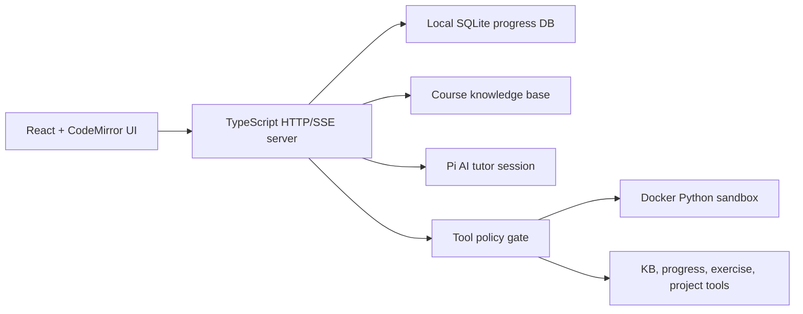

# Coding Mentor Agent

[](https://nodejs.org)
[](https://www.typescriptlang.org)
[](https://react.dev)
[](https://www.docker.com)

A local-first AI coding mentor for a Chinese-language Python course. The app combines a React learning interface, a TypeScript HTTP/SSE backend, a Practical Python knowledge base, adaptive diagnostics, progress tracking, and a Docker-backed Python sandbox.

[Features](#features) &bull; [Getting Started](#getting-started) &bull; [Configuration](#configuration) &bull; [Architecture](#architecture) &bull; [Development](#development) &bull; [Troubleshooting](#troubleshooting)

## Features

- **Tutor chat for Python learners**: explains concepts, reviews code, and guides debugging without bypassing the learning process.
- **Course-grounded knowledge base**: ships with a curated Practical Python catalog containing 9 units, 34 concepts, 25 exercises, mistake tags, and prerequisite relations.
- **Adaptive diagnostic flow**: places learners by concept readiness before unlocking structured practice.
- **Structured practice and project workflows**: selects exercises, creates practice contracts, reviews submissions, and records learning evidence.
- **Isolated Python execution**: runs student code and public tests in a Docker container with no network, dropped capabilities, memory limits, PID limits, and output truncation.
- **Local learning state**: stores sessions, mastery, evidence, practice reviews, and audit summaries in a local SQLite database under `.app` by default.
- **Tool policy and auditing**: gates model-visible tools by intent, caller, capability, and risk level, with redaction for secrets and local paths.

> [!IMPORTANT]
> Model-backed tutoring requires AI provider settings. Without `AI_PROVIDER` and `AI_API_KEY`, model-dependent chat turns return `MODEL_UNAVAILABLE`, although local catalog and diagnostic data can still initialize.

## Getting Started

### Prerequisites

- Node.js 24.x recommended. The Docker Compose setup uses `node:24.14.0-bookworm-slim`.
- npm.
- Docker Desktop or Docker Engine for code execution and grading.
- Python 3 if you plan to run the Python-based student-loop test harness.
- An AI provider API key for tutor responses.

### Run locally

```bash
npm install
cp .env.example .env
docker build -t coding-mentor-python-runner:0.1.0 -f sandbox-runner.Dockerfile .
npm start
```

Open [http://127.0.0.1:3000](http://127.0.0.1:3000).

On Windows PowerShell, use this instead of `cp`:

```powershell
Copy-Item .env.example .env
```

Then edit `.env` with your AI settings:

```ini
AI_PROVIDER=openai
AI_API=openai-responses
AI_BASE_URL=https://api.openai.com/v1
AI_MODEL=gpt-5.5
AI_API_KEY=your-api-key
```

### Run with Docker Compose

```bash
docker compose up --build
```

The Compose setup starts the app at [http://127.0.0.1:3000](http://127.0.0.1:3000), starts a sandbox service on the internal Compose network, and mounts the Docker socket so the sandbox service can launch isolated runner containers.

## Configuration

The app loads `.env` and `.env.local` from the repository root. Useful settings:

| Variable | Default | Purpose |
| --- | --- | --- |
| `PORT` | `3000` | Local HTTP server port. |
| `APP_DATA_DIR` | `.app` | SQLite database, Pi session files, backups, and test artifacts. |
| `COURSE_KB_ROOT` | `kb/python-course-kb-practical-python/wiki` | Course catalog and source content root. |
| `COURSE_KB_VERSION` | `kb-local` | Version label included in tutor prompts and catalog identity. |
| `ENABLED_BATCH` | `full` | Tool allowlist: `batch-a`, `batch-b`, `batch-c`, or `full`. |
| `SANDBOX_IMAGE` | `coding-mentor-python-runner:0.1.0` | Docker image used for Python execution. |
| `SANDBOX_SERVICE_URL` | empty | Optional HTTP sandbox service URL. Empty uses local Docker directly. |
| `SANDBOX_TIMEOUT_MS` | `3000` | Max runtime for simple Python execution. |
| `SANDBOX_PYTEST_TIMEOUT_MS` | `8000` | Max runtime for pytest grading. |
| `SANDBOX_MEMORY_MB` | `128` | Container memory limit. |
| `AI_PROVIDER` | empty | Provider name used by `@earendil-works/pi-ai`. |
| `AI_API` | empty | Set to `openai-responses` for the built-in Responses-compatible adapter. |
| `AI_BASE_URL` | `https://api.openai.com/v1` | HTTPS model API base URL. |
| `AI_MODEL` | `gpt-5.5` | Model id passed to the provider adapter. |
| `AI_API_KEY` | empty | API key for tutor responses. |

## Architecture



Key paths:

| Path | Purpose |
| --- | --- |
| `src/frontend` | React app, CodeMirror editor, SSE state handling, safe Markdown rendering. |
| `src/server` | HTTP API, sessions, diagnostics, progress policy, recommendations, project flow, local data management. |
| `src/agent` | Tutor prompt construction and Pi AI / Pi coding-agent integration. |
| `src/tools` | Course tools, schemas, envelopes, tool registry, and capability policy. |
| `src/sandbox` | Docker runner and optional HTTP sandbox service. |
| `src/db` | SQLite schema, migrations, bootstrap, and validators. |
| `src/security` | Redaction, path validation, ids, and in-memory rate limits. |
| `kb/python-course-kb-practical-python` | Bundled Practical Python source material, summaries, concepts, exercises, and catalog manifest. |
| `tests` | Vitest unit/integration coverage plus Playwright and Python student-loop harnesses. |

## API Surface

The backend serves the React app and exposes local JSON/SSE endpoints:

- `POST /api/sessions` creates or resumes a local tutor session.
- `GET /api/sessions/:id/events` streams assistant messages and tool events over SSE.
- `GET /api/sessions/:id/snapshot` returns the current conversation, practice, progress, and tutor state.
- `POST /api/sessions/:id/messages` sends a learner message and optional code.
- `GET /api/diagnostics/next` and `POST /api/diagnostics/:id/answers` drive the adaptive diagnostic flow.
- `GET /api/progress/me` returns local mastery and evidence summaries.
- `POST /api/code/run` executes Python through the gated sandbox.
- `GET /api/exercises/next` and `POST /api/exercises/:id/submissions` handle structured practice.
- `GET /api/data/export`, `POST /api/data/delete`, and `POST /api/data/backups` manage local learning data.

## Development

Common scripts:

| Command | Description |
| --- | --- |
| `npm start` | Build the Vite client and run the local server on `127.0.0.1`. |
| `npm run dev` | Same server entry point as `npm start`. |
| `npm run dev:frontend` | Start Vite for frontend-only iteration. |
| `npm run build` | Type-check and build the client into `dist/client`. |
| `npm run lint` | Run TypeScript type-checking with `tsc --noEmit`. |
| `npm test` | Run Vitest tests under `tests/**/*.test.ts`. |
| `npm run start:sandbox` | Start the optional HTTP sandbox service. |
| `npm run test:student-loop:realistic` | Run the realistic Python student-loop discovery harness. |
| `npm run test:student-loop:release` | Run the release-profile student-loop harness. |
| `npm run test:student-loop:security` | Run the security-profile student-loop harness. |

For UI-oriented checks, Playwright is configured to build the app and preview it at `http://127.0.0.1:4173`.

## Local Data

By default, all learner state lives under `.app`:

- `progress.db` stores profile, sessions, mastery, exercises, diagnostics, practice reviews, projects, audit logs, and security events.
- `pi-sessions` stores Pi agent session files.
- `student-loop` stores e2e harness artifacts.

Use `GET /api/data/export` for a redacted JSON export, `POST /api/data/backups` for an encrypted database backup, and `POST /api/data/delete` with `{"confirm":"DELETE_LOCAL_LEARNING_DATA"}` to clear local learner state.

## Troubleshooting

**`MODEL_UNAVAILABLE`**

Set `AI_PROVIDER`, `AI_MODEL`, and `AI_API_KEY` in `.env`. If using the built-in OpenAI-compatible Responses adapter, also set `AI_API=openai-responses`.

**Docker sandbox errors**

Make sure Docker is running and the runner image exists:

```bash
docker build -t coding-mentor-python-runner:0.1.0 -f sandbox-runner.Dockerfile .
```

**Port already in use**

Change `PORT` in `.env`, then restart the server.

**Practice is locked**

Complete the initial diagnostic first. The backend intentionally blocks structured practice until it has enough placement evidence.

**Reset local progress**

Delete `.app` while the server is stopped, or use the data deletion endpoint with the explicit confirmation token shown above.
